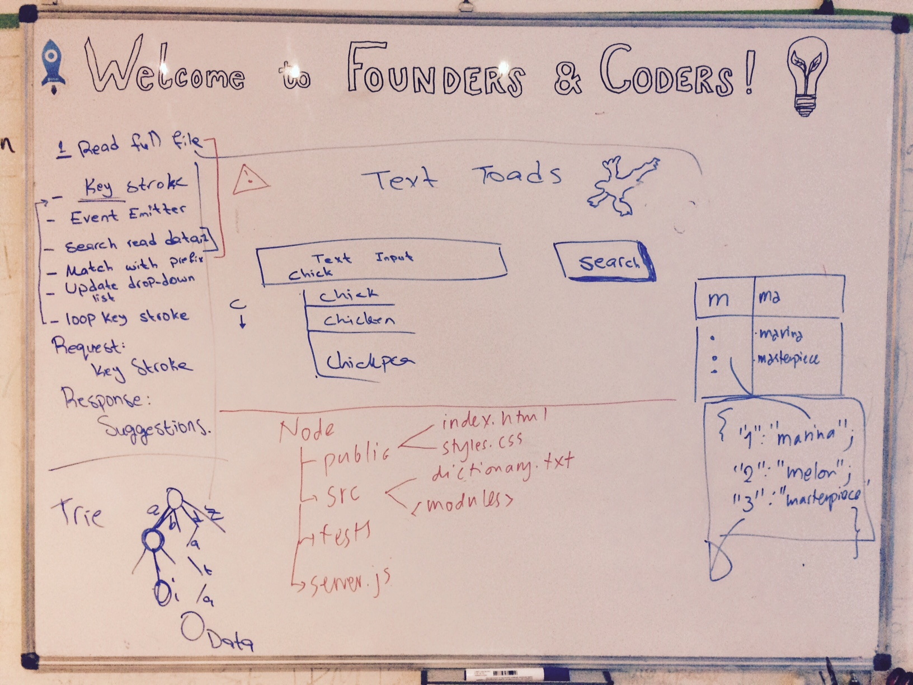

# Autocomplete project

Available online at https://nodetojoy-autocomplete.herokuapp.com/

## Objectives
- Word finder with autocomplete functionality and google search redirection
- Suggestions appear dynamically
- Testing on front-end and back-end
- Decent code coverage

## Stretch goals
- Modularize code
- Host the project on heroku
- Set up Continuous integration with Travis, and code coverage using codeCov and istanbul
- Get a full-suite of github repo badges in the readme

## Project plan

## Application flow
- Read dictionary file only once (for efficiency) and before starting the server
- Key stroke event listener
- Event emitter to send requests for word searching on key stroke event
- Search database (**dictionary sorted by popularity** as found [in this repo](https://github.com/first20hours/google-10000-english))
- Find matches with prefix
- Update drop-down list
- Possibility to select from drop-down list

__Client request__: key stroke

__Server response__: autocomplete suggestions

## Folder structure
- public
  - index.html
  - styles.css
  - app.js
- src
  - dictionary.txt
  - modules (.js)
  - server.js
- tests
  - tape-tests.js
  - qunit-tests.js
- package.json
- qunit.html
- .gitignore

## Front-end design
- Header/banner
- Text input box
- Search button
- Drop-down list

## Testing
- Front-end using qUnit
- Back-end using Tape
- Unit testing

## Daily progress

#### Wednesday
- Make project plan
- Research data structures (e.g. tries, hash tables etc) to improve performance
- Setup folder structure and basic front-end
- Start working on modules in the back end

#### Thursday
- Write front-end and back-end tests
- Add styling to webpage
- Build all required modules and import in the necessary files
- Set the server running

#### Friday
- Serve public files through the server (i.e. create routing rules)
- Fix require/export sequence (e.g. start server after loading dictionary database)
- Add more tests

#### Saturday
- Add selection functionality to dropdown list
- Add code (front-end and back-end) for edge cases (e.g. return no word matches if the user has only entered spaces)
- Change page styling to improve readability

#### Sunday
- Fix bugs in the front-end
- Refactor handler module
- Install Istanbul to get code coverage
- Heroku deployment (stretch goal)
